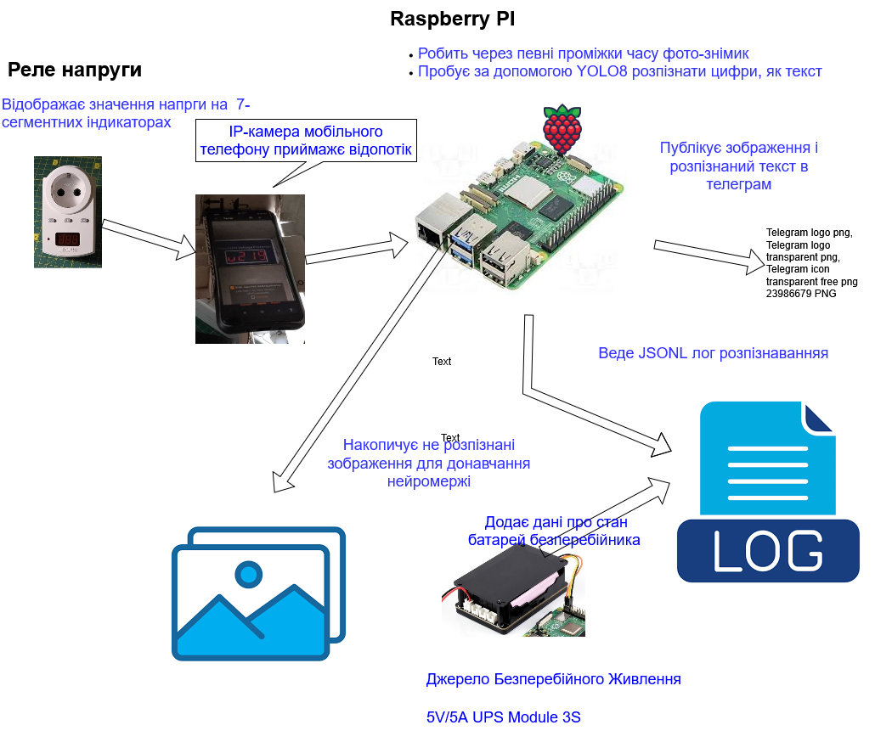
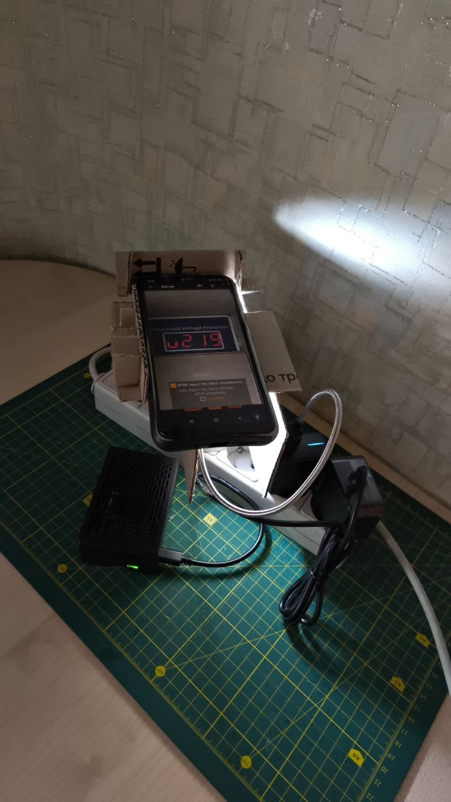
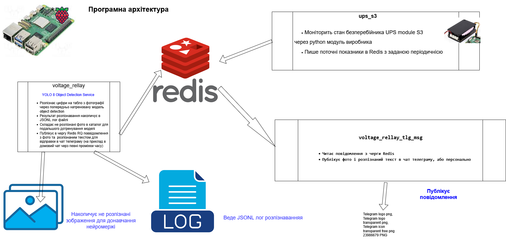
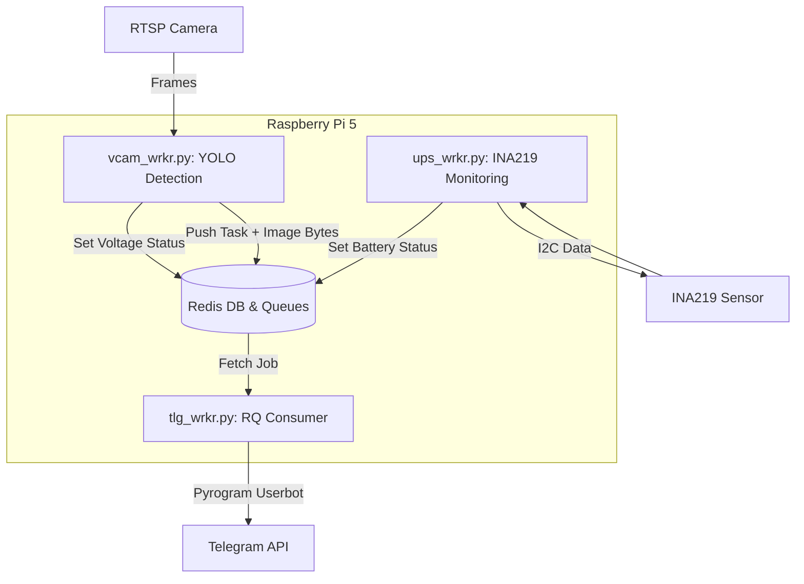
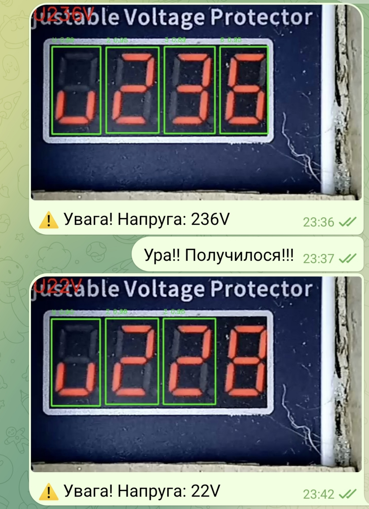
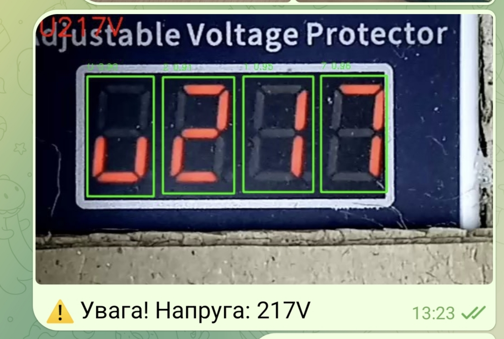
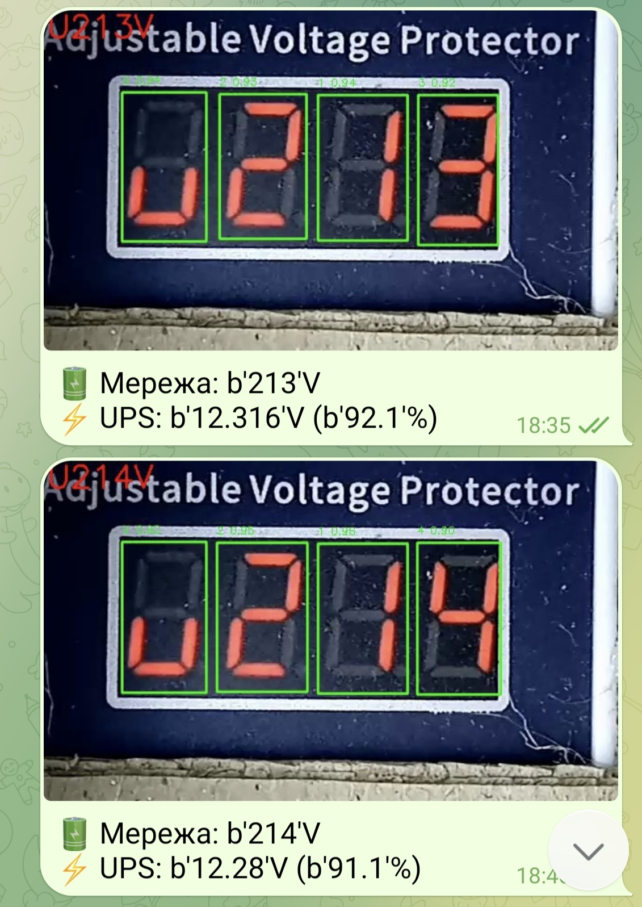

# Smart Energy Monitor "CardBoard Monster" - додаток, що підключається до RTSP-камери і  моніторить покази реле напруги

<!-- TOC BEGIN -->
- [1. Ціль](#p1)
- [2. Установка Redis як Native Servce на Raspberry PI5](#p2)
- [3. Запуск на Raspberry PI додатку розпізнавання напруги по фотографії](#p3)
- [4. Запуск на Raspberry PI додатку по відправці повідомлень в Telegram](#p4)
- [5. Запуск на Raspberry PI додатку для моніторингу стану UPS Module S3](#p5)

<!-- TOC END -->

## <a name="p1">1. Ціль</a>

Ціллю цього проекту є налаштування розпізнавання показів напруги, що показує реле напруги на 7-сегментних індикаторах.

**Особливості**:

- Цей проект є навчальний і не є придатним для масштабування чи повторення. Працює в "тепличних" умовах з конкретним реле напруги і конкретною камерою і при конкретних параметрах оствітлення.

- Розпізнавання побудоване на нейромережі YOLO8,  що налаштована та навчена власноруч.

- Проект є більше навчальним і призначений для відпрацювання операційних дій для налаштування, навчання та використання і донавчання нейромережі.

Тобто, цей проект є одним з компонентів для відпраювання операцій з додатками що використовують нейромережі та комп'ютерне бачення.

**Короткий опис**

Я запускаю  цей додаток на Raspberry PI, "як сервіс", але для відладки я використовував додаток, що запускався на власному ноутбуці. RTSP- камеру можна причепити до будь якого обчислювального пристрою, що підключений до IP-мережі.

Якщо додаток не розпізнав усі цифри, або впевненість розпізнавання занизька - в каталог to_label зберігається зображеня для подальшого донавчання нейромережі. Не розпізнані усі цифри - означає, що не визначені всі 4 сегменти з рівнем впевненості більше 0.6. Якщо додатко фіксує таку ситуацію з зображенням, то таке зображення відправляється в каталог  для донавчання нейромержі.

В каталог debug_images  зберігаються зображення з результатами розпізнавання, написаними  на картинці, поверх фотографії напруги.

В каталог db_detected записується jsonl лог з результатами розпізнавання для подальшого аналізую

Узагальнена компонентна діаграма показана на [pic-01](#pic-01)


<kbd></kbd>
<p style="text-align: center;"><a name="pic-01">pic-01</a></p>

В якості камери використовую мобільний телефон з додатком IP-Camera

<kbd></kbd>
<p style="text-align: center;"><a name="ipcam">ipcam</a></p>

Щоб забезпечити повторюване розміщення мобільного телефону над індикаторами реле, фокус зображення та координати прийшлося побудувати такого картонного монстра  [pic-03](#pic-03).


<kbd></kbd>
<p style="text-align: center;"><a name="pic-03">pic-03</a></p>

 А щоб компенсувати високу чутливість камери та надмірну яскравість індикаторів, прийшлося додати власну підсвітку та ізолювати від зовнішнього освітлення.

 Поряд поклав чорний корпус Raspberry PI, що виступив мозковим центром системи. 
 
 На  [pic-04](#pic-04) показана програмна архітектура.

 <kbd></kbd>
<p style="text-align: center;"><a name="pic-04">pic-04</a></p>

Так як це проект моніторингу, то краще Raspberry PI живити від безперебійника. У мене в наявності є [Джерело Безперебійного Живлення 5V/5A UPS Module 3S](https://evo.net.ua/dzherelo-bezperebiinoho-zhyvlennia-5v-5a-ups-module-3s-23884/), тому підключив його. Особливістю цього безперебійника є те, що він по шині  I2C  може передавати дані про стан акумуляторів, струм споживання/розряду та потужність споживання. При цьому, виробник надає python модуль, який може працювати консольно, або у складі додатку. От я додав сюди ще і додаток  моніторингу стану безперебійника.

Він також запускається не залежно від інших  додатків "як сервіс". Але цьому додатку треба передати свої дані до  інших двох додатків:

- Щоб додаток **voltage-rellay** їх прочитав та записав в JSONL-log;

- Щоб додаток **voltage_rellay_tlg_msg** їх прочитав та включив у повідмолення  Telegram.

Ці додатки не цікавить зміна протягом часу. Їх цікавить тільки поточне значення тому цей додаток публікує в Redis  3 значння  як KEY-VALUE, а два інших їх вичитують в потрібний їм момент. Тобто, реалізований такий собі механізм роздідяємої пам'яті між трьома додатками. На додаток, у нас ще є і черга для  даних, де має значення їх послідовність надходження. І в ній передаються не тільки текст а і байтовий образ фотографії з реле. Тому це дає можливість відслідковувати зміну напруги. Нижче навердена mermaid діаграма потоків даних.




**Архітектурний огляд** 

Система побудована на базі подійно-орієнтованої архітектури (Event-Driven) з використанням черг повідомлень. Це дозволяє розділити важкі обчислення (YOLO) від мережевих операцій (Telegram) та моніторингу сенсорів (I2C).

**Опис архітектурних компонентів**

1. VCam Worker (vcam_wrkr.py)

    Роль: "Очі" системи.

    Процес: Отримує потік з камери, вирізає ROI (область реле), проганяє через YOLOv8.

    Особливість: Не чекає відправки повідомлення. Він просто "кидає" бінарні дані картинки та текст у чергу Redis і повертається до наступного кадру.

2. UPS Worker (ups_wrkr.py)

    Роль: "Система життєзабезпечення".

    Процес: Читає через I2C дані про напругу та струм акумуляторів 3S.

    Інтеграція: Оновлює ключі в Redis (ups:v, ups:p, ups:a). Ці дані використовуються іншими воркерами для збагачення повідомлень.

3. Redis & RQ (Message Broker)

    Storage: Зберігає поточний стан (Shared State), до якого мають доступ всі скрипти.

    Queues: Використовує бібліотеку rq для гарантованої доставки повідомлень. Навіть якщо інтернет зникне, завдання накопичаться в черзі.

4. Telegram Worker (tlg_wrkr.py)

    Роль: "Голос".

    Технологія: Pyrogram (Userbot API).

    Логіка: Працює асинхронно. Бере картинку (байти) з Redis, додає до неї дані про стан UPS та надсилає користувачу.

**Чому саме така архітектура?**

- Відмовостійкість: Якщо впаде скрипт камери, моніторинг UPS продовжує працювати.

- Продуктивність: На Pi 5 ми максимально паралелимо процеси. Обробка відео не гальмує через повільний API Telegram.

- Гнучкість (MLOps): Ми можемо легко додати "Data Collector", який буде просто ще одним клієнтом Redis, що зберігає складні кадри для донавчання.


На [pic-05](#pic-05) ,  [pic-06](#pic-06)   та  [pic-07](#pic-07)  показані приклади повідомлень з Телеграм. На  [pic-07](#pic-07) саме показано повідмолення з даними стану UPS.

 <kbd></kbd>
<p style="text-align: center;"><a name="pic-05">pic-05</a></p>


 <kbd></kbd>
<p style="text-align: center;"><a name="pic-06">pic-06</a></p>


 <kbd></kbd>
<p style="text-align: center;"><a name="pic-07">pic-07</a></p>


JSON - лог має таку структуру.


```json
[
    {
        "timestamp": "2026-03-02T16:25:12.146203",
        "raw_voltage": "U212",
        "clean_voltage": 212,
        "detections": [
            {
                "class": "2",
                "confidence": 0.9581429958343506,
                "bbox": [
                    402,
                    85,
                    494,
                    251
                ]
            },
            {
                "class": "1",
                "confidence": 0.9557676315307617,
                "bbox": [
                    292,
                    83,
                    390,
                    249
                ]
            },
            {
                "class": "2",
                "confidence": 0.9319004416465759,
                "bbox": [
                    179,
                    82,
                    280,
                    248
                ]
            },
            {
                "class": "U",
                "confidence": 0.9142853021621704,
                "bbox": [
                    71,
                    78,
                    165,
                    248
                ]
            }
        ],
        "frame_id": 6,
        "isToLabel": false,
        "fail_filename": null,
        "debug_image": "debug_images\\roi_0006.jpg"
    },
    {
        "timestamp": "2026-03-02T16:25:44.186977",
        "raw_voltage": "U211",
        "clean_voltage": 211,
        "detections": [
            {
                "class": "1",
                "confidence": 0.9670955538749695,
                "bbox": [
                    401,
                    82,
                    497,
                    251
                ]
            },
            {
                "class": "1",
                "confidence": 0.9520029425621033,
                "bbox": [
                    293,
                    81,
                    391,
                    250
                ]
            },
            {
                "class": "2",
                "confidence": 0.942779004573822,
                "bbox": [
                    179,
                    80,
                    280,
                    249
                ]
            },
            {
                "class": "U",
                "confidence": 0.9125264286994934,
                "bbox": [
                    71,
                    77,
                    165,
                    248
                ]
            }
        ],
        "frame_id": 7,
        "isToLabel": false,
        "fail_filename": null
    },
    {
        "timestamp": "2026-03-02T16:26:48.137790",
        "raw_voltage": "U210",
        "clean_voltage": 210,
        "detections": [
            {
                "class": "1",
                "confidence": 0.95830237865448,
                "bbox": [
                    293,
                    81,
                    391,
                    253
                ]
            },
            {
                "class": "2",
                "confidence": 0.9465416669845581,
                "bbox": [
                    178,
                    79,
                    280,
                    250
                ]
            },
            {
                "class": "U",
                "confidence": 0.912695586681366,
                "bbox": [
                    71,
                    76,
                    165,
                    248
                ]
            },
            {
                "class": "0",
                "confidence": 0.7491042613983154,
                "bbox": [
                    402,
                    81,
                    497,
                    250
                ]
            }
        ],
        "frame_id": 9,
        "isToLabel": false,
        "fail_filename": null
    }
    
]

```


**Пов'язані проекти:**
Тут немає ще проекту по навчанню нейромережі. Він, поки, окремо і потребує дооформлення.
Але набір даних для навчаня є публічним  і можна взяти на roboflow [voltage-rellay-2](https://app.roboflow.com/pashakx/voltage-rellay-2/3)

## <a name="p2">2. Установка Redis як Native Servce на Raspberry PI5</a>

Redis використовується як роздіяємо пам'ять між сервісами, що забезпечує збереженя стану сервісів навіть після їх перезавантаження. Повідмолення в телеграм теж відправляються класично, через чергу Redis  на окремий додаток. Для економії писанини на SD-карту Redis ставиться не в контейнері, а окремо, як сервіс. Також тут описані параметри доконфігурації додатка, щоб працювати з  чергами з віддаленої машини.

1. Устарновкаа

```bash
sudo apt install redis-server
```

В результаті установки отримуємо щось схоже на це:

```text
Created symlink '/etc/systemd/system/redis.service' → '/usr/lib/systemd/system/redis-server.service'.
Created symlink '/etc/systemd/system/multi-user.target.wants/redis-server.service' → '/usr/lib/systemd/system/redis-server.service'.
```


2. Метод RDB (Redis Database Backup) — "Знімки" та додаткова конфігурація Redis

Тут налаштовуємо в Redis  періодичність скидання кешу пам'яті на диск.

```bash
 sudo nano /etc/redis/redis.conf
```

За замовчуванням стоїть 

```text

save 60 1  # Зберігати на диск, якщо пройшло 60 сек і змінився хоча 
```

Але, зважаючи що у нас SD-карта і повідомлення ідуть десь за 5 хвилин то можна поставити кешування 300 секунд 

```text
save 300 10    # Або кожні 5 хв, якщо було 10 змін
```

Зазвичай, у файлі конфігурації redis приймає запити тільки з localhsot 

```text
bind 127.0.0.1 -::1
```

Якщо хочемо підключатися до нього з віддаленої машини, то конфігурацію треба змінити на таку

```text
#bind 127.0.0.1 -::1
bind 0.0.0.0
```

У мене налаштовано підключення до Redis без авторизації. Це теж важливо для підключення з віддаленої машини. Якщо цього не зробити то для підключення з віддаленої машини прийдеться встановити пароль

```text
# By default protected mode is enabled. You should disable it only if
# you are sure you want clients from other hosts to connect to Redis
# even if no authentication is configured.
#protected-mode yes
protected-mode no
```

3. В автоматичних сервісах потрібно докрурити залежності так, щоб сервіс запускався уже після від Redis

```text


[Unit]
Description=YOLO Voltage Recognition Service
# Ось тут дві залежності (приблизно як в Docker-Compose)
After=network.target redis-server.service
Requires=redis-server.service

[Service]
# ... наші налаштування ...
Restart=always
```

## <a name="p3">3. Запуск на Raspberry PI додатку розпізнавання напруги по фотографії</a>

Проект передбачається запускати "як сервіс" на Raspberry PI,  тому треба налаштувати правильний записук і встановити залежності.

- Створення віртуального середовища та встановлення залежностей

```bash
# створити каталог додатку
cd /opt/voltage-rellay
# встановити права власнику каталога
sudo chown pi:pi /opt/voltage-rellay
# переходимо в каталог і встановлюємо залежності
cd /opt/voltage-rellay
# Встановлюємо залежності
## Створюємо віртуальне середовище
python3 -m venv env
## активуємо віртуальне середовища
source ./env/bin/activate
## Оновлюємо  pip
pip install --upgrade pip
## Встановлюємо залежності
pip install -r requirements.vcam.txt
```

- Налаштування конфігураційного файлу env -змінних **config.env**

```bash
sudo nano /opt/voltage-rellay/config.env
```

Для запуску проекту в системі потрібно налаштувати такі env-змінні:

```text
# URL підключення до камери
RTSP_URL=rtsp://>user>:<password>@host:port/path
# період отримання фото реле в сек. За замовчуванням 300 сек = 5 хвилин
CHECK_INTERVAL=300
# параметри підклчення до REDIS
# хост
RDS_HOST="localhost"
# порт
RDS_PORT="6379"
# нзава черги для відправки повідомлень
RDS_QUEUE="voltage_message"
# app_id  від телеграм
API_ID=****
# api_hash від телеграм
API_HASH=*****
# найменування файла-сесії
SESSION_NAME=****
# ідентифікатор користувача чи чату, комі відправляти повідомлення
CHAT_ID="****"

```

- Налаштування конфігурацsйного файлу сервіса

```bash
sudo nano /etc/systemd/system/voltage_rellay.service
```

- Текст конфігурайійного файлу

```text
[Unit]
Description=voltage_rellay Monitoring Service
# коли немаж залежностей (від Redis)
#After=network-online.target
#Wants=network-online.target

# Коли є залежності від Redis
After=network.target redis-server.service
Requires=redis-server.service

[Service]
# Шлях до папки з проєктом
WorkingDirectory=/opt/voltage-rellay
# Вказуємо шлях до нашого файлу зі змінними
EnvironmentFile=/opt/voltage_rellay/config.env
# Шлях до Python всередині venv та шлях до самого скрипта
ExecStart=/opt/voltage-rellay/env/bin/python /opt/voltage-rellay/vcam_runner.py

# Запуск від імені стандартного користувача RPi
User=pi
Group=pi

Restart=always
RestartSec=5

# Дозволяє бачити принти в логах journalctl одразу
Environment=PYTHONUNBUFFERED=1

[Install]
WantedBy=multi-user.target
```

- Запуск сервіса

```bash
sudo systemctl daemon-reload
sudo systemctl enable voltage_rellay.service
sudo systemctl start voltage_rellay.service
sudo systemctl status voltage_rellay.service
```

- моніторинг роботи логу

Тепер перевіримо, що сервіс дійсно працює, шляхом перегляду "живого" лога його роботи

```bash
journalctl -u voltage_rellay.service -f

```

-f вказує на те, що показувати лог в режимі реального часу

- Зупинка сервісу

Зупинка сервісу виконується командою:

```bash
sudo systemctl stop voltage_rellay.service

```

І знову треба перевірити логи, що сервіс зупинився:

```bash
journalctl -u voltage_rellay.service -f

```

- Дії, коли файл конфігурації сервісу треба змінити

```bash
sudo systemctl stop voltage_rellay.service
sudo systemctl daemon-reload
sudo systemctl start voltage_rellay.service
```

Для того, щоб перенсти фотгорафії для навчання чи сам журнал на Windows машину для подальшої ороботи можна використати такі команди

```bash
# З windows на Raspberry скопіювати file
scp -r  C:/DEV/model.ps user@host:/home/user/Downloads

# Скопіювати з raspberry зображення для навчання на windows машину
scp -r user@host:/opt/voltage-rellay/to_label C:/Users/<windows user>/Downloads/tolabel_1

scp -r user@host:/opt/voltage-rellay/db_detected/processing_log.jsonl C:/Users/<windows user>/Downloads/voltagelog


```

## <a name="p4">4. Запуск на Raspberry PI додатку по відправці повідомлень в Telegram </a>

Проект передбачається запускати "як сервіс" на Raspberry PI/  тому треба налаштувати правильний записук і встановити залежності.

- Створення віртуального середовища та встановлення залежностей

```bash
# створити каталог додатку
cd /opt/voltage_rellay_tlg_msg
# встановити права власнику каталога
sudo chown pi:pi /opt/voltage_rellay_tlg_msg
# переходимо в каталог і встановлюємо залежності
cd /opt/voltage_rellay_tlg_msg
# Встановлюємо залежності
## Створюємо віртуальне середовище
python3 -m venv env
## активуємо віртуальне середовища
source ./env/bin/activate
## Оновлюємо  pip
pip install --upgrade pip
## Встановлюємо залежності
pip install -r requirements.tlg.txt
```

- Скопіювати файл сесій телеграм на Raqspberry (якщо потрібно)

```bash
scp -r  ./mysessionfile.session user@host_raspberry:/opt/voltage_rellay_tlg_msg
```

- Налаштування конфігураційного файлу env -змінних **config.env**

```bash
sudo nano /opt/voltage_rellay_tlg_msg/config.env
```

Для запуску проекту в системі потрібно налаштувати такі env-змінні:

```text
# URL підключення до камери
RTSP_URL=rtsp://>user>:<password>@host:port/path
# період отримання фото реле в сек. За замовчуванням 300 сек = 5 хвилин
CHECK_INTERVAL=300
# параметри підклчення до REDIS
# хост
RDS_HOST="localhost"
# порт
RDS_PORT="6379"
# нзава черги для відправки повідомлень
RDS_QUEUE="voltage_message"
# app_id  від телеграм
API_ID=****
# api_hash від телеграм
API_HASH=*****
# найменування файла-сесії телеграм
SESSION_NAME=****
# ідентифікатор користувача чи чату, комі відправляти повідомлення
CHAT_ID="****"
```

- Налаштування конфігурацsйного файлу сервіса

```bash

sudo nano /etc/systemd/system/voltage_rellay_tlg_msg.service

```

- Текст конфігурайійного файлу

```text

[Unit]
Description=voltage_rellay_tlg_msg Send Telegram Notification
#After=network-online.target
#Wants=network-online.target
After=network.target redis-server.service
Requires=redis-server.service

[Service]
# Шлях до папки з проєктом
WorkingDirectory=/opt/voltage_rellay_tlg_msg
# Вказуємо шлях до нашого файлу зі змінними
EnvironmentFile=/opt/voltage_rellay_tlg_msg/config.env
# Шлях до Python всередині venv та шлях до самого скрипта
ExecStart=/opt/voltage_rellay_tlg_msg/env/bin/python /opt/voltage_rellay_tlg_msg/tlg_runner.py

# Запуск від імені стандартного користувача RPi
User=pi
Group=pi

Restart=always
RestartSec=5

# Дозволяє бачити принти в логах journalctl одразу
Environment=PYTHONUNBUFFERED=1

[Install]
WantedBy=multi-user.target

```

- Запуск сервіса

```bash
sudo systemctl daemon-reload
sudo systemctl enable voltage_rellay_tlg_msg.service
sudo systemctl start voltage_rellay_tlg_msg.service
sudo systemctl status voltage_rellay_tlg_msg.service

```

```bash
sudo systemctl stop voltage_rellay_tlg_msg.service

```

І знову треба перевірити логи, що сервіс зупинився:

```bash
journalctl -u voltage_rellay_tlg_msg.service -f

```
Якщо машина під windows і ви хочете запустити додаток відправки повідомлень в телеграм, то потрібно запускати в контейнері, бо пакет redis використовує linux-овий fork, якої під windows немає. Тому запукати треба в контейнері. Приклад  Dockerfile.dockerfile:

```Dockerfile
FROM python:3.11-slim

WORKDIR /app

# Встановлюємо залежності
COPY requirements.tlg.txt .
RUN pip install --no-cache-dir -r requirements.tlg.txt

# Копіюємо ваш код

COPY ./shared_tasks ./shared_tasks
COPY ./tlg_worker ./tlg_worker
COPY tlg_runner.py .
COPY your_file.session .


CMD ["python", "tlg_runner.py"]
```

Побудувати образ:

```bash
docker build -t tlgworker_img:latest -f Dockerfile.dockerfile .
```

Налаштувати .env -файл

Запустити контейнер

```bash
docker run -d --name tlg_worker --env-file .env tlgworker_img
```

Корисні команди:

```bash
# отримати логи контейнеру
docker logs tlg_worker -f
# зупинити контейнер
docker stop tlg_worker
# видалити контейнер
docker rm tlg_worker
```


## <a name="p5">5. Запуск на Raspberry PI додатку для моніторингу стану UPS Module S3</a>

Так як це проект моніторингу, то краще Raspberyy живити від безперебійника. У мене в наявності є [Джерело Безперебійного Живлення 5V/5A UPS Module 3S](https://evo.net.ua/dzherelo-bezperebiinoho-zhyvlennia-5v-5a-ups-module-3s-23884/), тому підключив його. Особливісю цього безперебійника є те, що він по шині  I2C  може передавати дані про стан акумулторів, строум споживання/розрядк та потужність споживання. При цьому, виробник надає python модуль, який може працювати конслольно, або у складі сервісу. От я  додав сюди ще і сервіс  моніторингу стану безперебійника.

Він так же запускається не залежно від інших  додатків "як сервіс". Але йцьому додатку треа передати свої дані до  інших:
- Щоб додаток **voltage-rellay** їх прочитав та записав в JSONL-log;
- Щоб додаток **voltage_rellay_tlg_msg** їх прочитав та включив у повідмолення  Telegram.

Ці додатки не цікавить зміна протягом часу. Їх цікавить тільки поточне значення тому цей додатко публікує в Redis  3 значння 
, а два інших їх вичитують в потрібний їм момент.


Проект передбачається запускати "як сервіс" на Raspberry PI,  тому треба налаштувати правильний записук і встановити залежності.

- Створення віртуального середовища та встановлення залежностей

```bash
# створити каталог додатку
cd /opt/ups_s3
# встановити права власнику каталога
sudo chown pi:pi /opt/ups_s3
# переходимо в каталог і встановлюємо залежності
cd /opt/ups_s3
# Встановлюємо залежності
## Створюємо віртуальне середовище
python3 -m venv env
## активуємо віртуальне середовища
source ./env/bin/activate
## Оновлюємо  pip
pip install --upgrade pip
## Встановлюємо залежності
pip install -r requirements.ups.txt
```

- Налаштування конфігураційного файлу env -змінних **config.env**

```bash
sudo nano /opt/ups_s3/config.env
```

Для запуску проекту в системі потрібно налаштувати такі env-змінні:

```text

# параметри підклчення до REDIS
# хост
RDS_HOST="localhost"
# порт
RDS_PORT="6379"

```

- Налаштування конфігурацsйного файлу сервіса

```bash
sudo nano /etc/systemd/system/ups_s3.service
```

- Текст конфігурайійного файлу

```text
[Unit]
Description=ups_s3 Monitoring UPS S3
# Коли є залежності від Redis
After=network.target redis-server.service
Requires=redis-server.service

[Service]
# Шлях до папки з проєктом
WorkingDirectory=/opt/ups_s3
# Вказуємо шлях до нашого файлу зі змінними
EnvironmentFile=/opt/ups_s3/config.env
# Шлях до Python всередині venv та шлях до самого скрипта
ExecStart=/opt/ups_s3/env/bin/python /opt/ups_s3/ups_runner.py

# Запуск від імені стандартного користувача RPi
User=pi
Group=pi

Restart=always
RestartSec=5

# Дозволяє бачити принти в логах journalctl одразу
Environment=PYTHONUNBUFFERED=1

[Install]
WantedBy=multi-user.target
```

- Запуск сервіса

```bash
sudo systemctl daemon-reload
sudo systemctl enable ups_s3.service
sudo systemctl start ups_s3.service
sudo systemctl status ups_s3.service
```

- моніторинг роботи логу

Тепер перевіримо, що сервіс дійсно працює, шляхом перегляду "живого" лога його роботи

```bash
journalctl -u ups_s3.service -f

```

-f вказує на те, що показувати лог в режимі реального часу

- Зупинка сервісу

Зупинка сервісу виконується командою:

```bash
sudo systemctl stop ups_s3.service

```

І знову треба перевірити логи, що сервіс зупинився:

```bash
journalctl -u ups_s3.service -f

```

- Дії, коли файл конфігурації сервісу треба змінити

```bash
sudo systemctl stop ups_s3.service
sudo systemctl daemon-reload
sudo systemctl start ups_s3.service
```
